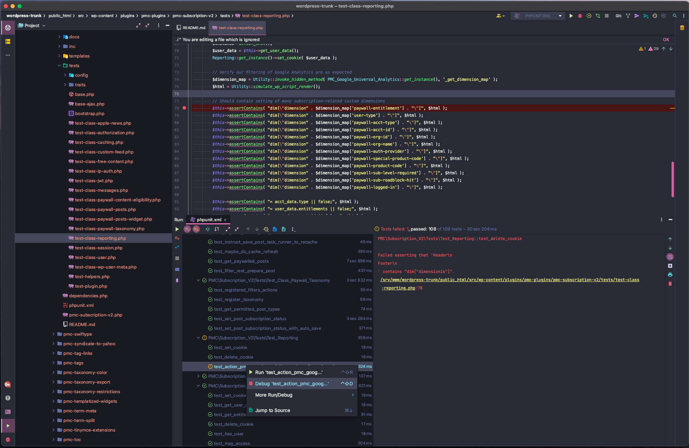

# PMC-VVV

Configuration repo for PMC's use of VVV.

VVV is an open source local development environment designed for WordPress developers, and is used for both working on WordPress sites and contributing to WordPress Core.

This repo holds both a complete `config.yml` for VVV as well as the tools to update it as the configuration changes or sites are added. For more information see: https://github.com/penske-media-corp/pmc-vvv-site-provisioners

## Prerequisites
If you're the proud recipient of an M1, M1 Pro, or M1 Max machine follow [M1 Prerequisites](#m1-prerequisites) below.

1. Install [VirtualBox](https://www.virtualbox.org/)
	- **Note for macOS 10.14 and above:** Due to updated security controls in macOS, VirtualBox will not install correctly unless you add Oracle's Developer ID to `spctl`.
	  -  `spctl` is a command-line interface to the same security assessment policy subsystem that Gatekeeper uses. Like Gatekeeper, `spctl` will only accept Developer ID-signed apps and apps downloaded from the Mac App Store by default. It will reject apps signed with Mac App Store development or distribution certificates.
	- The next step involved rebooting your computer and typing commands in the terminal when you can't access the internet or filesystem. Print or write down the following instructions.
	- Reboot into recovery mode (reboot and hold `Command` and `R` until the Apple logo appears, then release). Then open the Terminal (Utilities menu > Terminal) and type:
	```bash
	   $ spctl kext-consent add VB5E2TV963
	   $ reboot
	```
	- After reboot, install VirtualBox as normal and follow the instructions for enabling it via the Security & Privacy settings tab.
2. Install [Vagrant](https://www.vagrantup.com/)
3. Install VVV (Follow the "Installing VVV" steps here: https://varyingvagrantvagrants.org/docs/en-US/installation/#installing-vvv)

## M1 Prerequisites
These are prerequisites for Apple Silicon/Arm Chips.

1. Install [Parallels Pro](https://www.parallels.com/products/desktop/pro/) or the [Parallels Business Edition](https://www.parallels.com/products/business/). You can leverage the free trial to confirm everything is working, but it does require that you sign up and log into parallels on your machine to "activate" Pro features that are required to use Vagrant/VVV.
2. Install [Vagrant](https://www.vagrantup.com/)
3. Install VVV (Follow the "Installing VVV" steps here: https://varyingvagrantvagrants.org/docs/en-US/installation/#installing-vvv).

NOTE: For M1 Machines, makes sure to checkout to the `develop` branch rather than the main brach in VVV. Parallels support is currently in beta (as of 4/7/2022).


## Install
Setup is easy for M1 and non-M1 computers, authenticaion prep, config, and provision.

### Use Parallels
If you do not have an M1/Arm machine, skip to the next step.

In order to leverage parallels we must install the open source [Vagrant Parallels Provider](https://github.com/Parallels/vagrant-parallels).

``` bash
$ vagrant plugin install vagrant-parallels
```

You can confirm the install by running

``` bash
$ vagrant plugin list
```

### Authentication Prep
Provisioning requires SSH access to both Bitbucket and GitHub. Your host machine must share your SSH key with VVV using `ssh-agent` (aka key forwarding).

``` bash
$ ssh-keygen
```

Hit enter to each question. For both Bitbucket and Github add your SSH keys to their respective sit options.
 - [Bitbucket SSH Docs](https://support.atlassian.com/bitbucket-cloud/docs/set-up-an-ssh-key/)
 - [Github SSH Docs](https://docs.github.com/en/github/authenticating-to-github/connecting-to-github-with-ssh/generating-a-new-ssh-key-and-adding-it-to-the-ssh-agent)

Add your private SSH key to the `ssh-agent` **on your host machine**:
```bash
$ ssh-add -K [PATH TO YOUR PRIVATE KEY]
# e.g. ssh-add -K /Users/pmcjames/.ssh/id_rsa
```

For newer macOS version:
```bash
$ ssh-add --apple-use-keychain [PATH TO YOUR PRIVATE KEY]
# e.g. ssh-add --apple-use-keychain /Users/pmcjames/.ssh/id_rsa
```

### Configs
- Copy `config.yml` from this repo to the `config` directory in your VVV install, i.e. `~/VVV/config/config.yml`.
  - Within the copied `config.yml`, enable the site or sites you need by changing the site's `skip_provisioning`
       value to `false`. By default, no sites are provisioned, allowing each
       developer to install only the sites they work on. Each site takes
       approximately 3.5 minutes to provision.
  - If desired, add optional PMC utilities to the `utilities.pmc` array towards
       the end of the copied `config.yml`.
  - Towards the bottom of the copied `config.yml`,
        you may adjust the `vm_config` and `disksize` values if needed,
        such as when working with databases from some of our larger sites.

### Provision
Provision Vagrant (i.e. install dependencies for the first time) as usual:

```bash
$ vagrant up --provision
```

Note that at any time in the future, you can change which sites are provisioned
and run `vagrant provision` to create the new sites. VVV does not remove sites
that were previously provisioned, but it does remove the site's hosts entry,
restricting access to only WP-CLI.

## HTTPS (SSL)

To match production, all local environments are configured to use HTTPS URLs.
Browsers will display certificate errors after you first provision VVV.

To fix these errors, see VVV's instructions [here](https://varyingvagrantvagrants.org/docs/en-US/references/https/trusting-ca/).

## Default WordPress Login

Username: `pmcdev`

Password: `pmcdev`

## Unit Tests

For each site you provision, e.g. Sportico, you may run the theme and pmc-plugins unit tests by following the steps below. Do steps 1-3 once, and steps 4+ for each provisioned site, e.g. Sportico, WWD, etc.. The basic concept here is that we copy the testing tools from wordpress-develop into each provisioned site.

NOTE, Ideally, we could provision wordpress-trunk into VVV via [custom-site-template-develop](https://github.com/Varying-Vagrant-Vagrants/custom-site-template-develop) (by setting skip_provisioning: false in config.yml) as it provides phpunit, test database, and the wp test suite. However, it forces you to use the latest (unreleased) version. Using its master branch can/has lead to issues when running tests with our pmc-unit-test bootstrap.php. Due to this, we setup the test environment manually (steps 1-3 below).

1. Install phpunit
    ```bash
    # If not in VM...
    $ vagrant ssh
    ```
    In VM...
    ```bash
    $ sudo mkdir -p /usr/share/php/phpunit
    $ cd /usr/share/php/phpunit
    $ sudo composer require --dev phpunit/phpunit ^7 --update-with-all-dependencies
    $ sudo ln -sf /usr/share/php/phpunit/vendor/bin/phpunit /usr/bin/phpunit
    ```
1. Get the WP Test Suite
    ```bash
    # If not in VM...
    $ vagrant ssh
    ```
    In VM...
    ```bash
    # As of Sept 2021 pmc-unit-test is compatible with WP 5.8
    # This is due to https://core.trac.wordpress.org/changeset/51559, as pmc-unit-test is not yet compatible with yoast/phpunit-polyfills
    $ cd ~/
    $ git clone --depth 1 --branch 5.8.1 git@github.com:WordPress/wordpress-develop.git
    ```
1. Copy the WP Test Suite per site
    ```bash
    # If not in VM...
    $ vagrant ssh
    ```
    In VM...
    ```bash
    $ cp -r ~/wordpress-develop/tests/ /srv/www/sportico-com/public_html/
    ```
1. Create `wp-tests-config.php` per site
    ```bash
    # If not in VM...
    $ vagrant ssh
    ```
    In VM...
    ```bash
    $ cp ~/wordpress-develop/wp-tests-config-sample.php /srv/www/sportico-com/public_html/wp-tests-config.php
    ```
    1. open the file you copied `wp-tests-config.php` in your editor / IDE of choice.
    2. change line 4 to `define( 'ABSPATH', dirname( __FILE__ ) . '/' );`
    3. Configure `DB_*` named constants: NOTE the DB_NAME should match your provisioned site (see wp-config.php)
        ```
        define( 'DB_NAME', 'sportico-com' );
        define( 'DB_USER', 'wp' );
        define( 'DB_PASSWORD', 'wp' );
        define( 'DB_HOST', 'localhost' );
        ```
    4. Add the following constants
        ```
        define( 'PMC_IS_VIP_GO_SITE', true );
        define( 'VIP_GO_APP_ENVIRONMENT', 'development' );
        ```
1. Run tests
    1. Note, we must tell PHPUnit where our test bootstraps are located. Note, this must be done each time you SSH into vagrant (See below PHPStorm docs to automate this). Note, change `sportico-com` to the site you're testing within.
    2. Note, if xdebug is enabled your tests will run VERY slowly. See [xDebug documentation](https://varyingvagrantvagrants.org/docs/en-US/references/xdebug/ ). Only enable xdebug while testing if you wish to step-through debug your tests or generate a code coverage report.


    ```bash
    # If not in VM...
    $ vagrant ssh
    ```

    In VM...
    ```bash
    You can add these variables to your bash, but make sure they are at the bottom of ~/.bash_profile as not to conflict with vvv's settings.
    $ export PMC_PHPUNIT_BOOTSTRAP=/srv/www/sportico-com/public_html/wp-content/plugins/pmc-plugins/pmc-unit-test/bootstrap.php
    $ export WP_TESTS_DIR=/srv/www/sportico-com/public_html/tests/phpunit

    # If you edited ~/.bash_profile reload it.
    $ source ~/.bash_profile

    # Navigate to a pmc-plugin or a theme where `phpunit.xml` exists. E.g.
    $ cd /srv/www/sportico-com/public_html/wp-content/plugins/pmc-plugins/pmc-piano/

    # Run tests
    $ phpunit
    ```

To run tests in PHPStorm and/or Step-Through debug tests, see here: https://confluence.pmcdev.io/x/sIyzB (this replaces steps 4-7 above)



## FAQ

### Where are the errors?

VVV is configured to write the `WP_DEBUG` log to `~/wp-content/debug.log` rather
than printing those messages to the screen.

This can be disabled on a per-site basis by changing the `WP_DEBUG_LOG` constant
to `false`.

### Single posts are redirecting to the homepage. What do I do?

Flush the rewrite rules in `wp-admin` under VIP > Dashboard > Rewrite Rules.

### I'm already using `pmc-vvv`. What's next?

There are several options for adopting the latest VVV configuration.

1. Start fresh:
   1. Run `vagrant destroy`
   1. Delete the VVV directory
   1. Check out VVV, drop in the new configuration, and provision
1. Migrate to a fresh instance:
   1. Run `vagrant destroy`
   1. Copy the database backups to a safe location (from `database/sql/backups`)
   1. Delete the VVV install and start anew
   1. Import the database backup and update URLs
      1. Copy the database backup to the new site's VVV folder
      1. Run `vagrant ssh` and change to the new site's directory
      1. Run `wp db import [FILE]`
      1. Run `wp search-replace [OLD URL] [NEW URL]`
      1. Flush the cache: `wp cache flush`
1. Set up a new VVV instance alongside your existing one. As long as both aren't
   running at the same time, they can coexist.
1. Retain sites set up using `build-me-vvv.sh` (**NOT RECOMMENDED**):
   1. Modify the generated config so that the site slug and host matches what's
      currently in use.
   1. Set the site to use the
      [default VVV provisioner](https://github.com/Varying-Vagrant-Vagrants/custom-site-template)
      rather than our custom one, pulling from the `master` branch
   1. Run `vagrant destroy` and `vagrant provision`

      The existing sites will remain, including the unused `wpcom.test` network,
      and you'll need to reconcile your updates with any future changes to the
      generated config, but this will retain all of your existing sites in case
      you have something set up that you cannot part with.

## Miscellaneous Issues

### 04/26/2022

Error: Provisioning fails with the message `fatal: unsafe repository ('/srv/provision/utilities/pmc' is owned by someone else)`. It is not resolved by re-adding the SSH key nor by running the suggested command `git config --global --add safe.directory`.

Fix: Confirm you are using Git v2.35.3+ and run the following command before running the command to provision:

```
git config --global --add safe.directory *
```

Note: You might need to update Git to the latest version. The steps for updating Git will vary depending on your operating system, so search for instructions as needed. [Here is a Mac-specific guide](https://git-scm.com/download/mac) maintained by Git community members.

### 04/12/2022
Error: Unable to launch xdebug with Parallels.

Fix: Ensure that the pathMappings for your IDE are as follows: `"/srv/www/": "/Users/USERNAME/vvv-local/www/",`. And confirm that there are not two instances of `define( 'WP_DEBUG', true|false );` in the `wp-config.php` file for the site you're attempting to run xdebug for. In the `vvv-local/config/php-config/xdebug.ini` find or add the `xdebug.discover_client_host=` value and set it to `1` instead of `0`. Run `vagrant provision` to reprovision your local.

### 04/07/2022
Error: While running `vagrant up` the box will warn that `vagrant-goodhosts` plugin is not installed and will suggest `vagrant plugin install --local` will fix the issue. It does not.

Fix: Install the `vagrant-goodhosts` plugin manually. `vagrant plugin install vagrant-goodhosts` followed by `vagrant reload --provision` to ensure that all dependencies are in sync.

### 03/11/2021
Error: During `vagrant up --provision` encountered `default: sudo: unable to execute /usr/local/bin/wp: Permission denied`. Upon SSHing into Vagrant (`vagrant ssh`) noted with `ls -al /usr/local/bin/wp` that this wp-cli script was owned by `root` and within the group `root`.

Fix: While SSH'd into Vagrant, delete wp-cli with `rm /usr/local/bin/wp` then provision again. Afterwards, wp-cli was properly owned by `vagrant` user and within the `www-data` group.

### 12/17/2020
Error: `git@github.com: Permission denied (publickey).fatal: Could not read from remote repository.` during provision pmc utilities (found in provisioner-utility-soucre-pmc.log)

Fix: Add key to ssh-agent using: `ssh-add -K [PATH_TO_PRIVATE_KEY]`
### 2/11/2020

Error: `Failed to start The PHP 7.2 FastCGI Process Manager.` during
provisioning and 502 Bad Gateway error in HTTP response.

Fix: Update VVV to latest version and `vagrant reload --provision`. See
[this Github issue](https://github.com/Varying-Vagrant-Vagrants/VVV/issues/2061#issuecomment-583557584)
for further troubleshooting.

### 2021
An error during initial creation/provisioning on Macbook Pros.

```bash
VBoxManage: error: VBoxNetAdpCtl: Error while adding new interface: failed to open /dev/vboxnetctl: No such file or directory
VBoxManage: error: Details: code NS_ERROR_FAILURE (0x80004005), component HostNetworkInterfaceWrap, interface IHostNetworkInterface
```
The solution seems to be to restart your Mac laptop in Recovery mode (cmd + R), then open a Terminal and enter:
```bash
spctl kext-consent add VB5E2TV963
```
and restart. VB5E2TV963 is the Oracle developer ID.

### 10/11/2021
Updating the vagrant-goodhosts plugin to 1.0.18 causes the error `check_hostnames_to_add': undefined method each` during provisioning.
Goodhosts has acknowledged the error in this [this Github issue](https://github.com/goodhosts/vagrant/issues/40#issuecomment-940871327).
Rolling back to 1.0.17 or a later version with the fix should fix the issue.

### 12/30/2021
When provisioning, getting an SSH error:
```
The SSH command responded with a non-zero exit status. Vagrant assumes that this means the command failed.
```
This could be from a reboot on Mac OS which clears existing SSH keys. In that case, re-add the key with `ssh-add -K /path/to/private/key`

## Related repos:

This configuration builds on two additional repositories, in keeping with the
patterns established by VVV. This should lower the maintenance burden by
leveraging as much of the open-source project as possible.

1. Utilities: https://github.com/penske-media-corp/pmc-vvv-utilities

   This repo contains all PMC modifications to VVV, such as installing our PHPCS
   standards and creating a local cache of shared code used during site
   provisioning.
1. Provisioners: https://github.com/penske-media-corp/pmc-vvv-site-provisioners

   This repo contains PMC's extensions of VVV's site provisioners. These
   leverage features added by our custom utilities and take the place of the
   build script that previously handled tasks like installing `pmc-plugins` and
   a site's theme(s).

## Updating `config.yml`

This repo includes a node script that generates `config.yml`. It handles the
boilerplate configuration while supporting the configuration options relevant
to PMC.

1. Update `sites.json` as needed.
   1. If adding a new site, its entry in the array should be keyed by the
      primary domain. The list is ordered alphabetically!

      Below is a configuration that illustrates the available options:
      ```json
      "example.com": {
        "site_title_prefix": "Example",
        "theme_repo": "git@bitbucket.org:penskemediacorp/pmc-spark.git",
        "theme_slug": "",
        "parent_theme_slug": "pmc-core-v2",
        "grandchild_theme_repo": "",
        "theme_dir_uses_vip": false
      }
      ```

      Notes:
      * `theme_slug` is optional. When omitted, the theme repo's slug is used;
        in the above example, the slug would be `pmc-spark`.
      * `grandchild_theme_repo` is optional and is used for international
        sites, such as Robb Report UK.
      * `theme_dir_uses_vip` defaults to `false` and can be omitted unless set
        `true`.
1. If necessary, run `npm install`.
1. Run `node generate-config.js`.
1. Commit the `sites.json` and `config.yml` changes.
